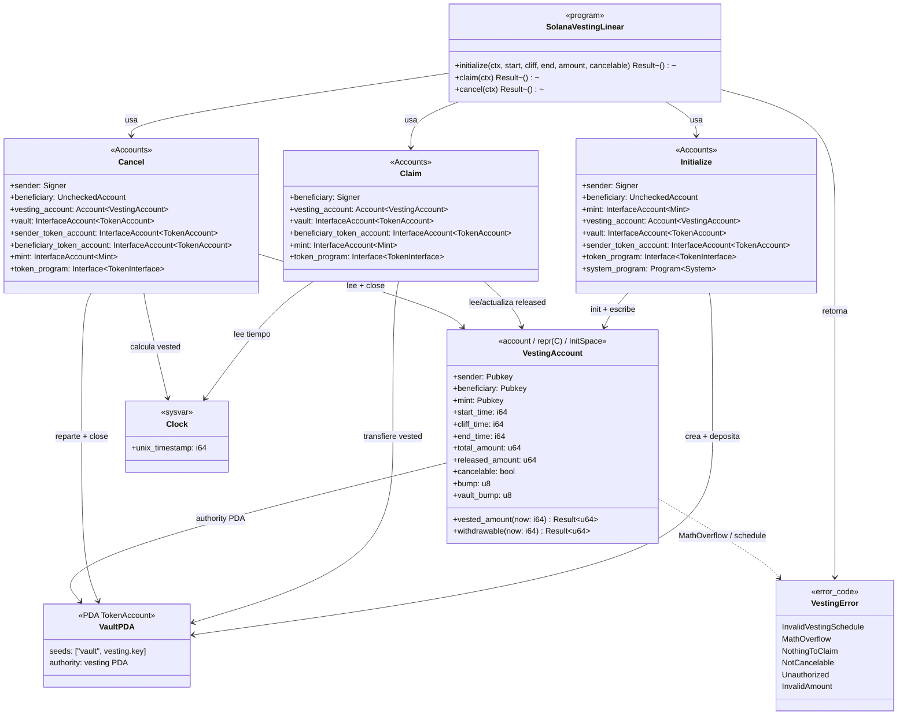
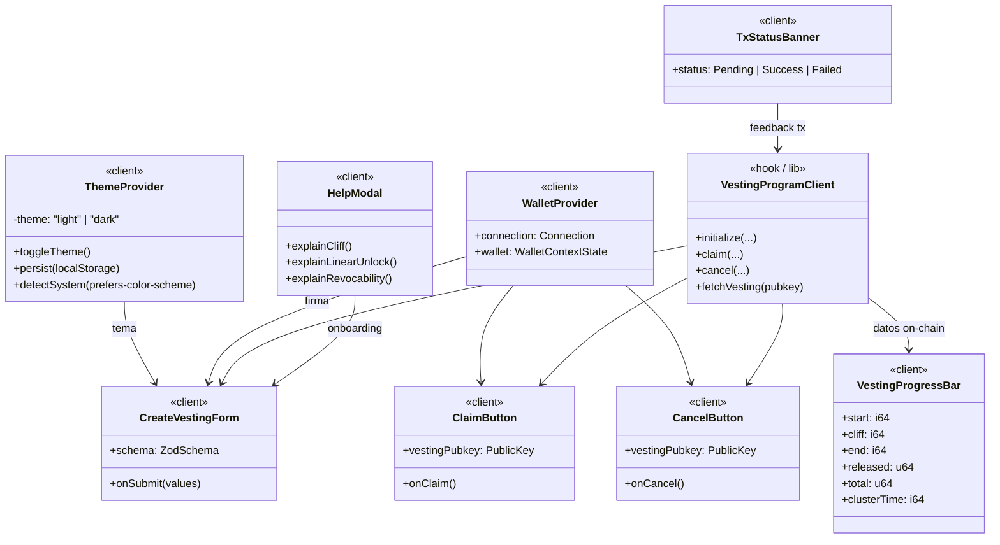

# Diagrama de clases — solana-vesting-linear

Vista estructural del dominio on-chain (Anchor) y de la capa frontend (Next.js).  
Sintaxis: Mermaid `classDiagram`.

---

## 1. Dominio on-chain (programa Anchor)

### Notas de diseño

| Elemento | Decisión |
|----------|----------|
| `VestingAccount` | `#[repr(C)]` + `InitSpace`; espacio = `8 + INIT_SPACE` |
| Tokens | `token_interface` → SPL Token y Token-2022 |
| Reloj | Solo `Clock` sysvar; nunca timestamp del cliente |
| Cierre | `close = sender` en cancel / claim completo |

---

## 2. Capa frontend (Next.js / React)

### Contratos de tipado (frontend)

- Props y retornos tipados; **sin `any`**.
- Formularios y params validados con **Zod**.
- Cada componente/hook con **JSDoc** (`@description`, `@param`, `@returns`).
