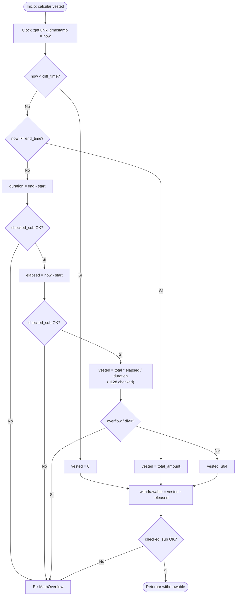
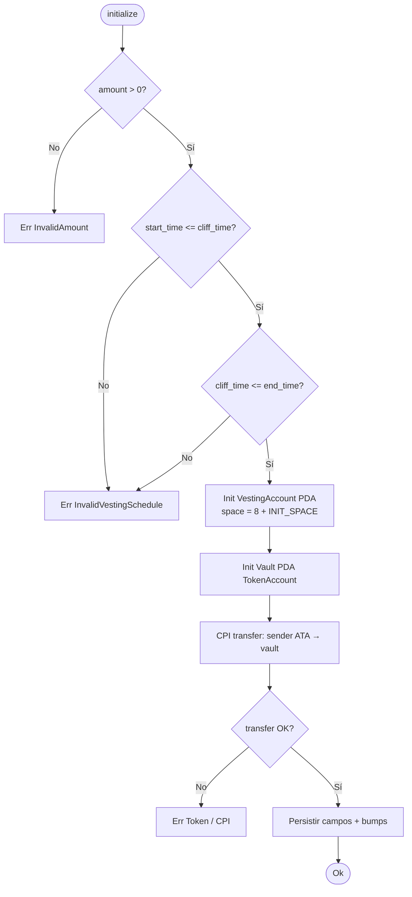
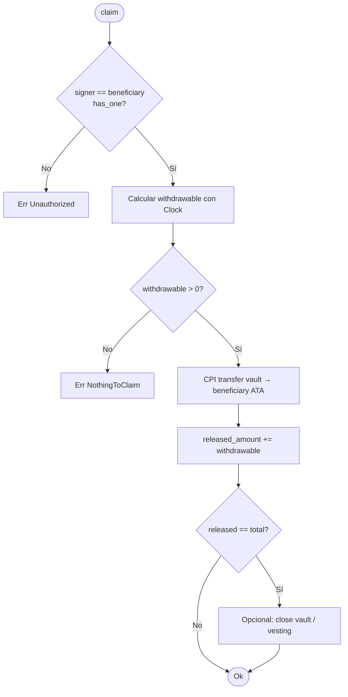
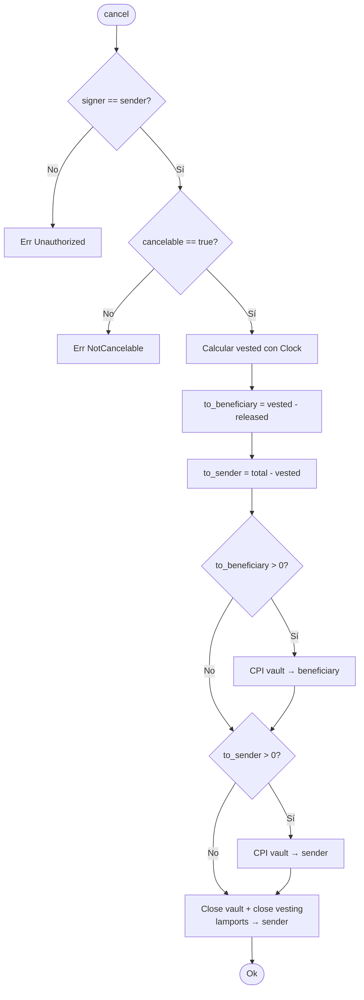

# Diagrama de flujo — lógica on-chain

Decisiones algorítmicas del programa: validación de schedule, cálculo lineal y ramas de cada instrucción.  
Sintaxis: Mermaid `flowchart`.

---

## 1. Cálculo de `vested_amount` / `withdrawable`



---

## 2. Instruction `initialize`



---

## 3. Instruction `claim`



---

## 4. Instruction `cancel`



---

## Invariantes temporales

```text
start_time  ≤  cliff_time  ≤  end_time
released_amount  ≤  vested(now)  ≤  total_amount
```

Cualquier violación de schedule en `initialize` → `InvalidVestingSchedule`.  
Overflow en aritmética → `MathOverflow` (sin panic / sin unwrap).
