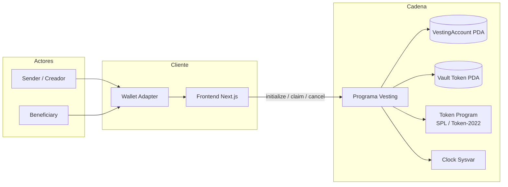
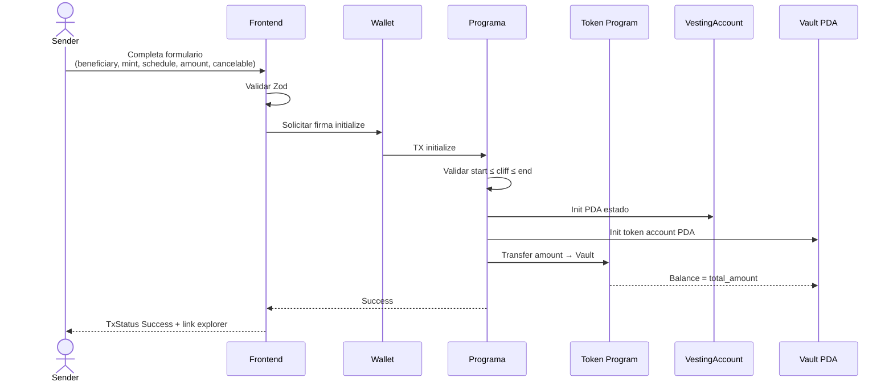
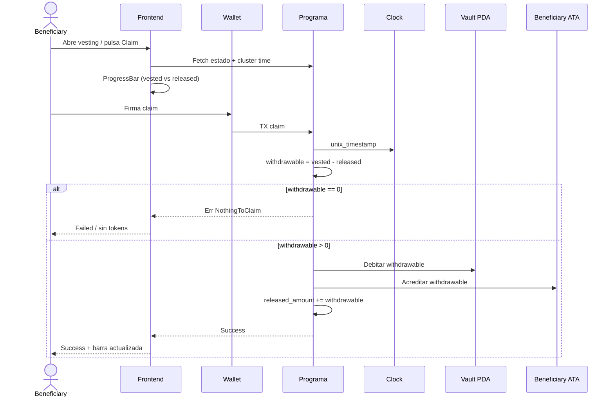
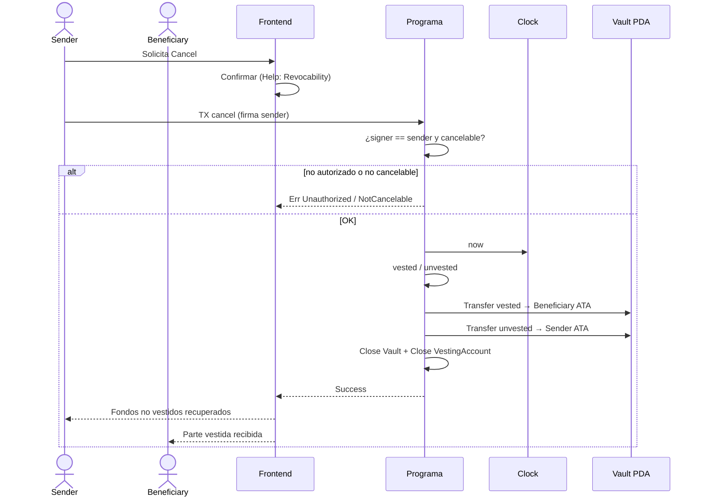
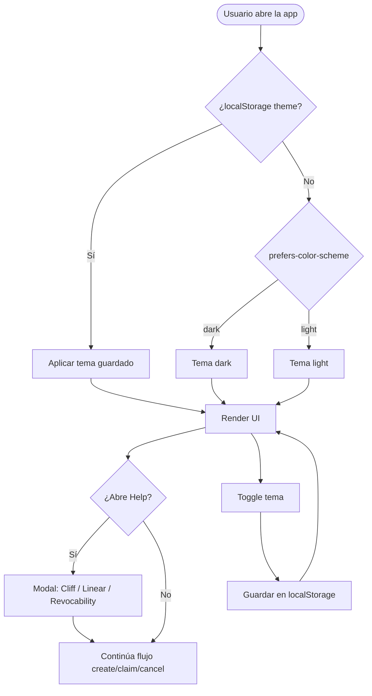
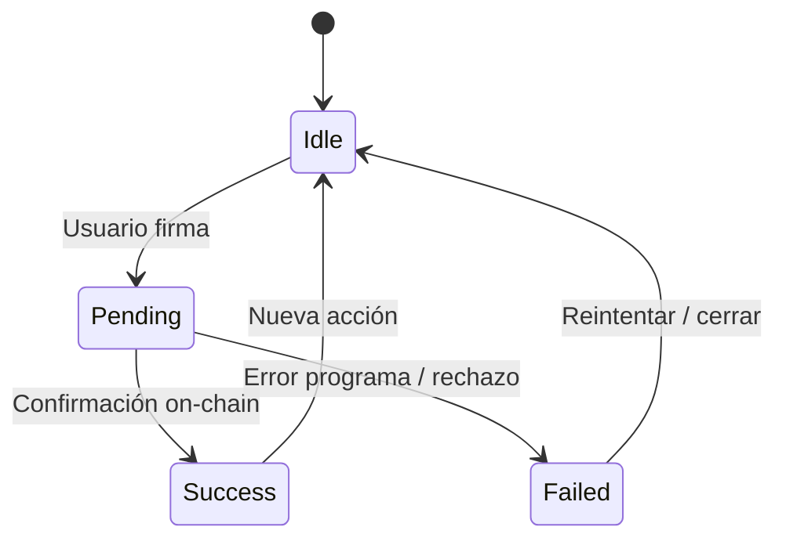

# Flujograma — actores y procesos de negocio

Secuencia de interacción entre **Sender**, **Beneficiary**, **Frontend**, **Programa** y **Token Program**.  
Complementa el diagrama de flujo (decisiones internas) con la visión de proceso extremo a extremo.

---

## 1. Flujograma general del ciclo de vida

---

## 2. Proceso: crear vesting (Sender)

---

## 3. Proceso: reclamar tokens (Beneficiary)

---

## 4. Proceso: revocar vesting (Sender)

---

## 5. Flujograma UX: tema y ayuda

---

## 6. Estados de transacción (feedback UI)

---

## Leyenda de roles

| Rol | Puede |
|-----|--------|
| **Sender** | `initialize`, `cancel` (si `cancelable`) |
| **Beneficiary** | `claim` de tokens ya vestidos |
| **Frontend** | Validar inputs, mostrar progreso y Help; **no** decide el tiempo de vesting |
| **Programa** | Única fuente de verdad temporal (`Clock`) y de balances |
